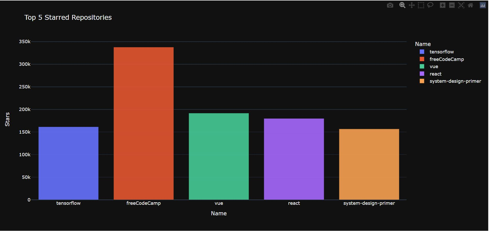
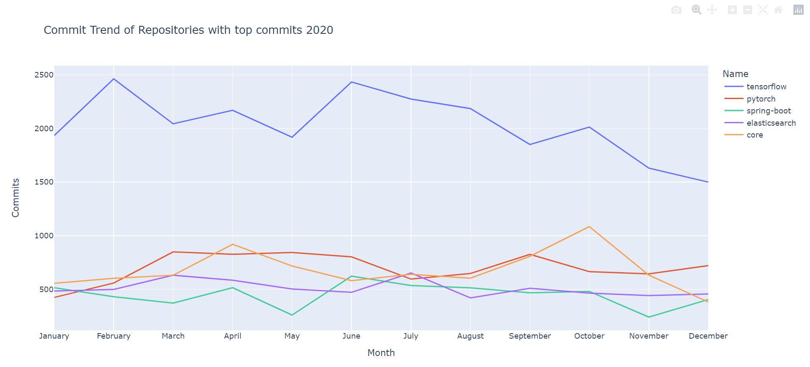
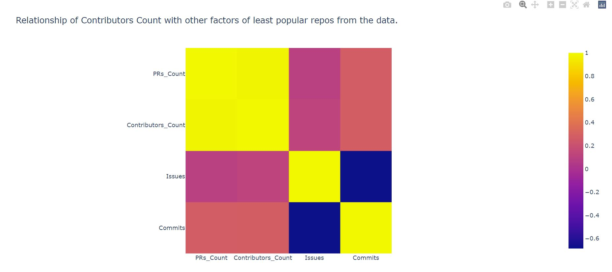
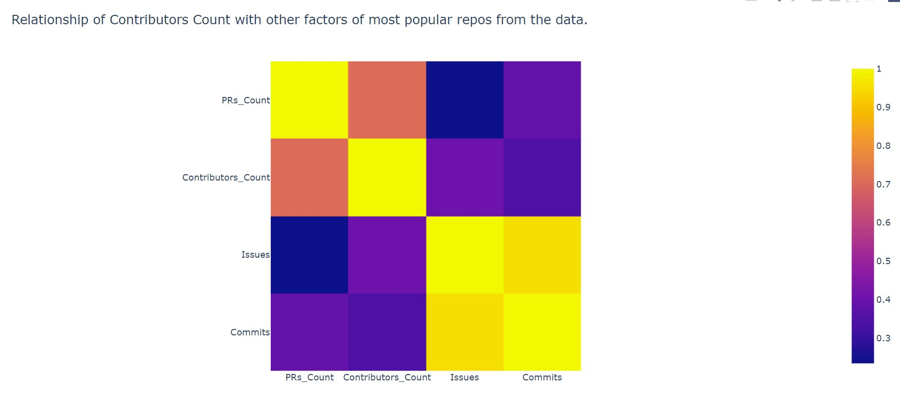
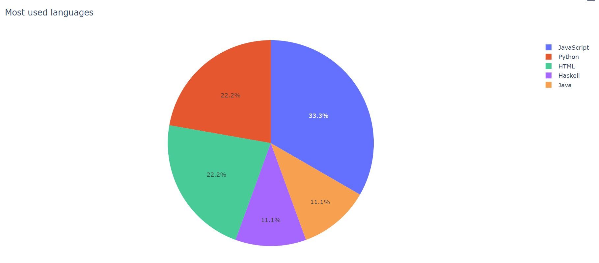
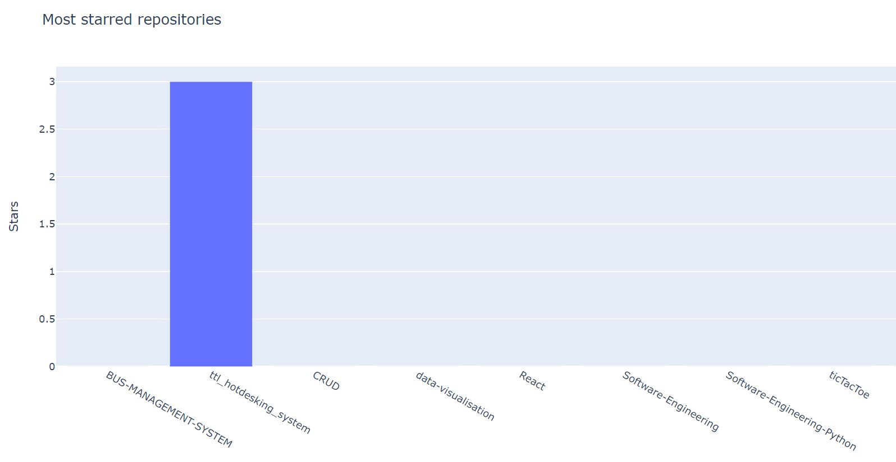
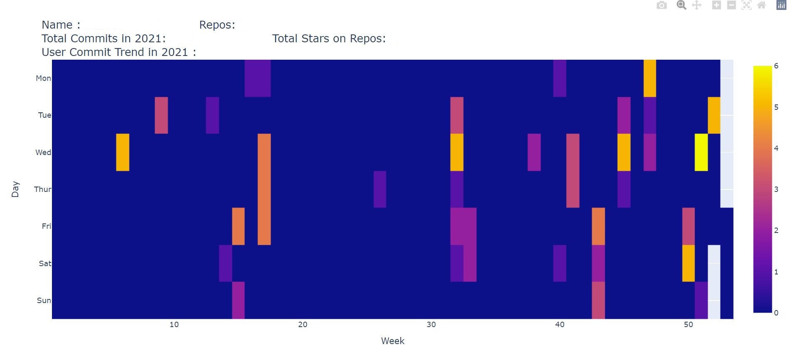

This is the visualisation of the Github data that is collected through Github API.

Commands to visualise:
Use command './repoVis.sh' to visualise repos based on topics.
Use command './userVis.sh' to visulaise repos for a user.

Dependencies:-
Pymongo
Plotly
docker
pandas
numpy

Important Note:- 
1.)Command use 'python' command to execute. if you use 'python3' or any other command please change the shell files.
2.)If already using pymongo database with names 'githubuser' or 'githubuser_single', make sure to clear the database using      commands:
'python cleardb.py'
'python cleardbuser.py'
3.)Please set volumes value and python version in file docker-compose.yml
4.)User is asked for a token to fetch data from github. It is preffered that a token is used. However on writing a wrong toke,
a username is asked and used for fetching data.

This visualisation works in three Steps:
1.Gathering data from github and saving it into a pymongo database using docker.
2.Processing that data and saving it into csv files.
3.Fetching data from csv files and visualising them using Plotly and pandas.

This visualisation contains two parts.

1.)
First, the visualisation of repositories fetched by specifying some topics for the year 2020.
We collect four to six repository data for each topic based on how many are tagged with that topic.
This data is saved to a csv file under the name 'repoData.csv'.
Then the data is visualised in form of three graphs.
a.)The top five repositories with most stars.

b.)The monthly commits are plotted on a line chart.

c.)A heapmap of the the correlation between factors in the least popular repositories.

d.)A heapmap of the the correlation between factors in the most popular repositories.

Use command './repoVis.sh' to execute this entire process.

2.)
Second, the visualisation of user repositories.
We collect repository data for the user and save it into database.
This data is saved to a csv files under the name 'userInfo.csv' and 'commit_history.csv'.
For this data we plot:
a.)A pie chart of the languages used in % according to number of repositories using them.

b.)A bar chart of the stars and repositories. 

c.)Finally, a commit frequency chart that shows the commit trend of user in past year.

Use command './userVis.sh' to execute this entire process.

Troubleshoot:
docker-compose up command may carry out unnecessary outputs. In this case you can comment out ./run-db.sh in the main command files if docker is already running. 